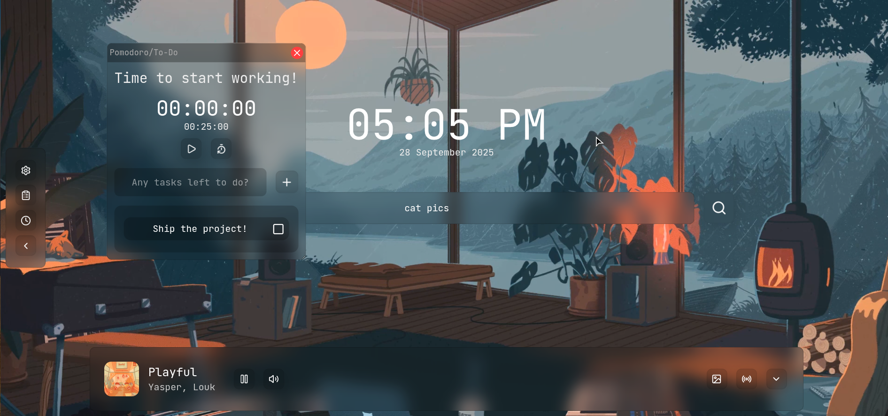
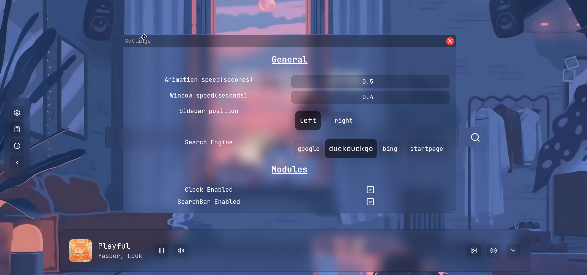
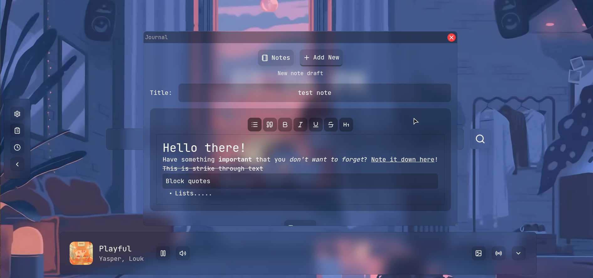
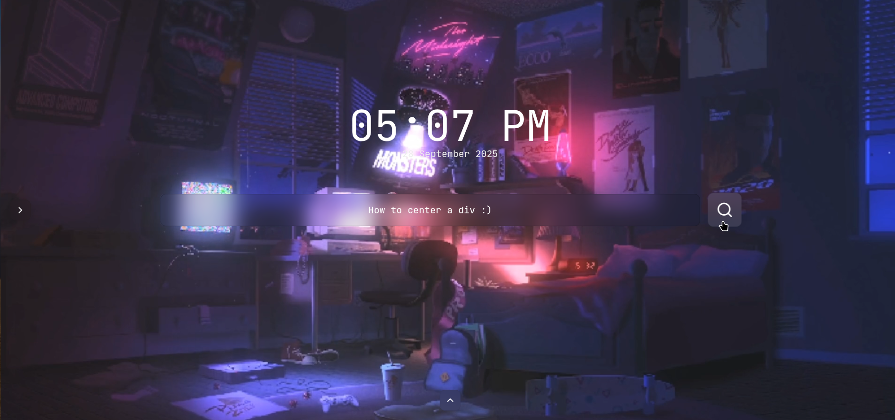

# Mizuha
## Overview
A glassmorphism-themed and customizable new tab application made with next.js

## Demo
You can check it out right now, over here: [https://mizuha.vercel.app](https://mizuha.vercel.app)

Don't try it on mobile devices though, it would look terrible.

## Features
- Super smooth animations, thanks to [motion](https://motion.dev)
- Customizable, you can toggle modules, animation speeds, etc.
- Not cluttered, and you can remove/hide stuff that you don't like!
- Lofi-music playback from [chillhop](https://chillhop.com)
- To-Do list/Pomodoro timer, to improve productivity
- Journal, to note down anything that you think you would forget. You can also use it as a personal diary, it supports markdown.(uses [tiptap](https://tiptap.dev) )
- Doesn't store anything on server-side, everything is on your device! or in other words, complete privacy!

## Screenshots

## Known issues

- Issues with music playback, takes quite some time to find a song without 404 endpoints

## Tech Stack
- Next.JS
- Vercel
    
## FAQ
### 1. What's new with this new tab?
Looks, customizability and productivity! I just tried to make something that has totally different vibes compared to other new tab apps. I also like to listen lofi-songs in my free time, so I made a new tab page that has a lofi-music player in-built:)

### 2. What features are you going to add in the future?
I have a lot of stuff in my mind. I can make a lot more customizable, by adding color customizability, few more modules like daily quotes, website shortcuts,
and many wallpapers from chillhop itself. Honestly I feel that I should have made the website shortcuts thing at least, but I am moving towards a really tight schedule, so that's for some other day.

### 3. Music isn't playing, or buffering too much, what should I do?
Try reloading or hard reloading, or maybe try changing the station. I honestly don't know why chillhop api returns so many 404 endpoints, but I will do more research on it later on, till then, that's what you can do.... OR You can make the fix yourself and send a PR! I would happily review the code ASAP.

 ## Credits

I am truly grateful to [SrIzan](https://srizan.dev) for making [lofi.srizan.dev](lofi.srizan.dev), it was my inspiration for this project.
I would also like to acknowledge [chillhop](https://chillhop.com) for providing songs for this project.

>  Please go and show some love to SrIzan by starring their lofi github repo :3

## Contribution

You can contribute by raising an issue or making a pull request, I will happily review them and merge them as soon as possible:)
> If you like this app, please star this repo, that will motivate me to develop it further! ✨
